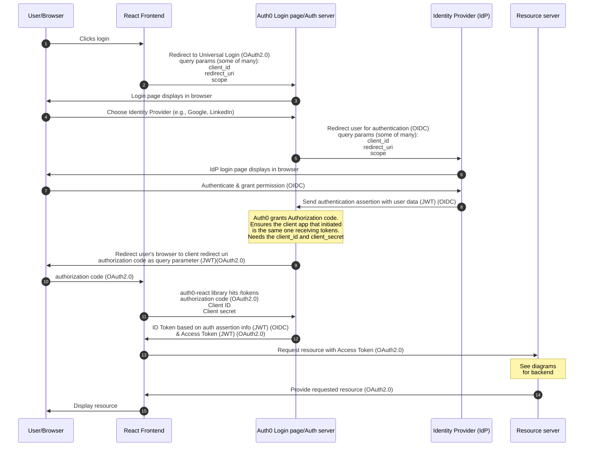

### OIDC and Oauth2.0 information flow using Auth0 in this app

```mermaid
sequenceDiagram
    participant User as User/Browser
    participant Client as React Frontend
    participant Auth0 as Auth0 Login page/Auth server
    participant IdP as Identity Provider (IdP)
    participant RS as Resource server
    
    autonumber
    User->>Client: Clicks login
    Client->>Auth0: Redirect to Universal Login (OAuth2.0)<br/>query params (some of many):<br/>client_id<br/>redirect_uri<br/>scope
    Auth0->>User: Login page displays in browser
    User->>Auth0: Choose Identity Provider (e.g., Google, LinkedIn)
    Auth0->>IdP: Redirect user for authentication (OIDC)<br/>query params (some of many):<br/>client_id<br/>redirect_uri<br/>scope
    IdP->>User: IdP login page displays in browser
    User->>IdP: Authenticate & grant permission (OIDC)
    IdP->>Auth0: Send authentication assertion with user data (JWT) (OIDC)
    Note over Auth0: Auth0 grants Authorization code.<br/>Ensures the client app that initiated<br/>is the same one receiving tokens.<br/>Needs the client_id and client_secret
    Auth0->>User: Redirect user's browser to client redirect uri <br/>authorization code as query parameter (JWT)(OAuth2.0)
    User->>Client: authorization code (OAuth2.0)
    Client->>Auth0: auth0-react library hits /tokens<br/> authorization code (OAuth2.0)<br/> Client ID<br/> Client secret
    Auth0->>Client: ID Token based on auth assertion info (JWT) (OIDC)<br/>& Access Token (JWT) (OAuth2.0)
    Client->>RS: Request resource with Access Token (OAuth2.0)
    Note over RS: See diagrams<br/>for backend
    RS->>Client: Provide requested resource (OAuth2.0)
    Client->>User: Display resource
```
